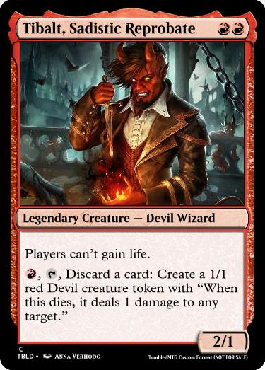

# Group 69 - TumbledMTG Analysis

## Milestones

Details for Milestone are available on Canvas (left sidebar, Course Project) or [here](https://firas.moosvi.com/courses/data301/project/milestone01.html).

## Describe your topic/interest in about 150-200 words

This project will be analyzing information directly relevant to our hobby. With this project we hope to gain greater insight into the pool of cards available to players. For example, understanding the proportion of cards available that cost a lot of resources compared to few resources can give insight into what new cards might be most beneficial to add to the game in order to make sure players have many deck-building options. It would be exciting to build a dashboard for users to access the data so that players can also gain insights into the game.

Brett:

Thomas:
I will be taking a look at the decklists we have collected. More specifically, I will be looking at what the average deck is made of and how it compares to the decks that are winning tournaments. Some particular fields of interest are the average mana value of a decklist, what is the most common deck color, and how many lands does the average deck use.

## Describe your dataset in about 150-200 words

The data for cards and decklists from the tumbledmtg.com magic the gathering format. Magic: the Gathering is a card game where players assemble decks of cards and and then play against one another using those decks. TumbledMTG is a fan-format curated by us, so we have a special interest in the data. The data we will analyze includes a multitude of information for each card such as mana cost, card color, and card type. Our data set also includes information about the decks players have assembled, such as how many resources each deck requires and what card colors the deck includes.

## Team Members

- Thomas: I like to program and play tetris, I also made [tumbledmtg.com](https://tumbledmtg.com).
- Brett:

## Images

